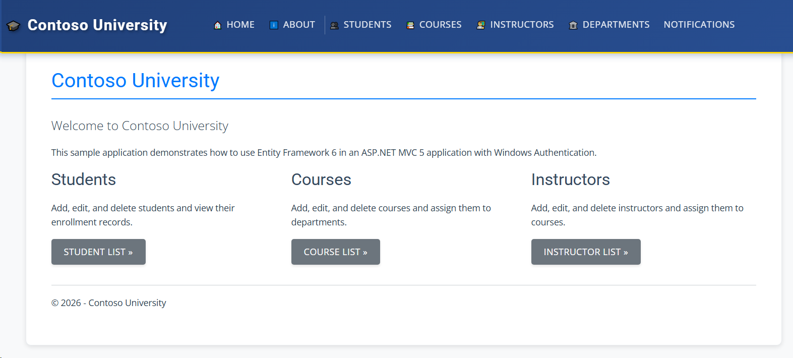

# Deploy ContosoUniversity (Legacy .NET) to Azure VM

This folder contains Terraform configuration and a PowerShell setup script that deploys the **ContosoUniversity** ASP.NET MVC 5 / .NET Framework 4.8 application to a Windows Server 2022 Virtual Machine — the "before" state of the modernization journey.

## What Gets Deployed

| Component | Details |
|---|---|
| VM OS | Windows Server 2022 Datacenter |
| VM Size | `Standard_D2s_v3` (2 vCPU / 8 GB RAM) |
| Web Server | IIS with ASP.NET 4.x |
| Database | SQL Server Express 2019 (local, `.\SQLEXPRESS`) |
| Messaging | MSMQ (Windows Message Queuing) |
| App URL | `http://<public-ip>` |

## Prerequisites

- [Terraform](https://developer.hashicorp.com/terraform/install) ≥ 1.5
- [Azure CLI](https://learn.microsoft.com/cli/azure/install-azure-cli) — logged in (`az login`)
- An Azure subscription with permissions to create resource groups and VMs

## Deploy

### 1. Create your variables file

```bash
cp terraform.tfvars.example terraform.tfvars
```

Edit `terraform.tfvars` and set:
- `admin_password` — must be 12+ characters with upper, lower, digit, and special character

> **Note:** At `terraform apply` time, Terraform calls `https://api.ipify.org` to detect your outbound public IP and automatically scopes the NSG RDP rule to that address. If your IP changes (e.g. after a network switch), re-run `terraform apply` to update the rule.

### 2. Initialise and apply

```bash
terraform init
terraform plan
terraform apply
```

Terraform will output:
- `public_ip` — the VM's public IP address
- `app_url` — `http://<public-ip>` (available after setup completes)
- `rdp_command` — RDP connection command

### 3. Wait for setup to complete

The `CustomScriptExtension` runs `setup.ps1` automatically after the VM starts. This installs:
- Chocolatey, Git, SQL Server Express 2019
- IIS features + ASP.NET 4.x
- MSMQ
- Visual Studio 2022 Build Tools
- Clones, builds, and deploys the application

**Total setup time: approximately 15–20 minutes.**

### 4. Verify the application

Open a browser and navigate to `http://<public-ip>`.

You should see the ContosoUniversity home page. On first load, the application creates the database schema automatically via `DbInitializer`.



## Connecting via RDP

```
mstsc /v:<public-ip>
```

Log in with:
- **Username:** the value of `admin_username` (default: `azureadmin`)
- **Password:** the value of `admin_password` from your `terraform.tfvars`

## Troubleshooting

### App not reachable after 20 minutes

Check the extension logs in Azure Portal:

```
Azure Portal → Virtual Machines → <vm-name> → Extensions + Applications
→ CustomScriptExtension → View detailed status
```

Or RDP into the VM and inspect:

```
C:\setup-contoso.log
C:\WindowsAzure\Logs\Plugins\Microsoft.Compute.CustomScriptExtension\
```

### SQL Server service not running

From an RDP session:
```powershell
Get-Service -Name "MSSQL*"
Start-Service -Name "MSSQL$SQLEXPRESS"
```

### IIS application pool stopped

```powershell
Import-Module WebAdministration
Start-WebAppPool -Name "ContosoUniversity"
Start-Website -Name "ContosoUniversity"
```

## Clean Up

```bash
terraform destroy
```

This removes all Azure resources created by this configuration.
