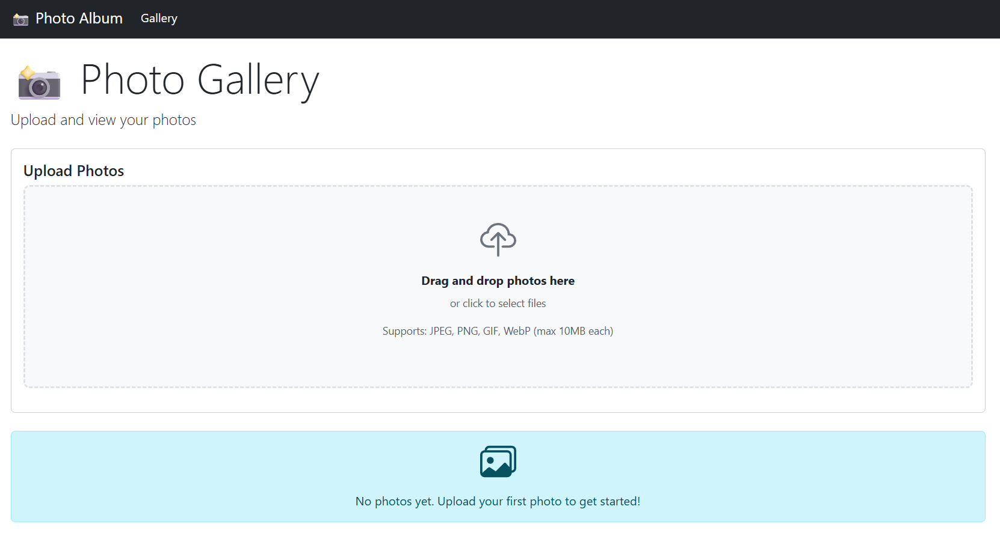

# Deploy PhotoAlbum (Legacy Java) to Azure VM

This folder contains Terraform configuration and a Bash setup script that deploys the **PhotoAlbum** Spring Boot 2.7 / Java 8 / Oracle application to an Ubuntu 22.04 Virtual Machine — the "before" state of the modernization journey.

## What Gets Deployed

| Component | Details |
|---|---|
| VM OS | Ubuntu 22.04 LTS (Gen2) |
| VM Size | `Standard_D4s_v3` (4 vCPU / 16 GB RAM) |
| Runtime | Docker Engine + Docker Compose |
| Database | Oracle Free (`gvenzl/oracle-free:latest`) — no Oracle registry login required |
| Application | Spring Boot 2.7.18 / Java 8 |
| App URL | `http://<public-ip>:8080` |

## Prerequisites

- [Terraform](https://developer.hashicorp.com/terraform/install) ≥ 1.5
- [Azure CLI](https://learn.microsoft.com/cli/azure/install-azure-cli) — logged in (`az login`)
- An Azure subscription with permissions to create resource groups and VMs

## Deploy

### 1. Create your variables file

```bash
cp terraform.tfvars.example terraform.tfvars
```

Edit `terraform.tfvars` and set:
- `admin_password` — a strong password (12+ chars, upper+lower+digit+special, no underscores)

> **Note:** At `terraform apply` time, Terraform calls `https://api.ipify.org` to detect your outbound public IP and automatically scopes the NSG SSH rule to that address. If your IP changes (e.g. after a network switch), re-run `terraform apply` to update the rule.

### 2. Initialise and apply

```bash
terraform init
terraform plan
terraform apply
```

Terraform will output:
- `public_ip` — the VM's public IP address
- `app_url` — `http://<public-ip>:8080`
- `ssh_command` — ready-to-use SSH command

### 3. Wait for setup to complete

The `setup.sh` script runs automatically at first boot via cloud-init. It:
- Installs Docker Engine + Docker Compose
- Clones the PhotoAlbum-Java repository
- Runs `docker compose up --build -d`
- Installs a systemd service for reboot persistence

**Total setup time: approximately 5–10 minutes** (Oracle takes 3–5 minutes to initialise on first run).

### 4. Verify the application

```bash
# SSH into the VM (enter the admin_password you set in terraform.tfvars)
ssh azureuser@<public-ip>

# Check container status
sudo docker compose -f /opt/photoalbum/docker-compose.yml ps

# Follow application logs
sudo docker compose -f /opt/photoalbum/docker-compose.yml logs -f photoalbum-java-app
```

Then open a browser and navigate to `http://<public-ip>:8080`.

You should see the PhotoAlbum gallery page ready to accept photo uploads.



## Troubleshooting

### App not reachable after 15 minutes

SSH into the VM (using the password from `terraform.tfvars`) and check the cloud-init log:

```bash
cat /var/log/photoalbum-setup.log
cat /var/log/cloud-init-output.log
```

### Oracle container is unhealthy

Oracle XE/Free performs a lengthy first-time initialisation that can take up to 5 minutes. The Spring Boot app is configured to wait (`depends_on` with health check). You can monitor Oracle progress:

```bash
sudo docker compose -f /opt/photoalbum/docker-compose.yml logs oracle-db
```

### Spring Boot fails to connect to Oracle

If the app started before Oracle was ready, restart it:

```bash
sudo docker compose -f /opt/photoalbum/docker-compose.yml restart photoalbum-java-app
```

### Port 8080 not accessible

Verify the NSG rule exists in Azure Portal, then check UFW on the VM:

```bash
sudo ufw status
sudo ufw allow 8080/tcp   # if UFW is active and blocking
```

## Clean Up

```bash
terraform destroy
```

This removes all Azure resources created by this configuration.
